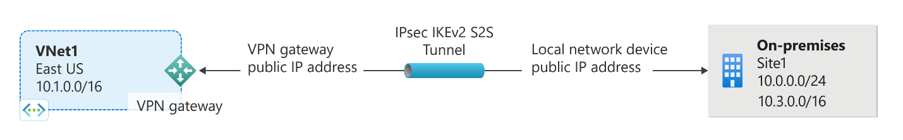

### **Introduction**
Azure VPN est un service proposé par Microsoft Azure qui permet de relier en toute sécurité un réseau (site-to-site) ou un appareil individuel (point-to-site) à un réseau virtuel (VNet) hébergé dans le cloud Azure. Le tout via une connexion chiffrée transitant par Internet.

Ainsi, les utilisateurs peuvent accéder aux ressources Azure comme s’ils étaient directement connectés à leur réseau local.

C’est une solution performante, flexible et économique qui facilite l’établissement de liaisons sécurisées entre les infrastructures locales et le cloud.

Imaginons un scénario :

- Dans votre entreprise, la majorité de l’infrastructure est hébergée dans le cloud Azure. Cependant, vos équipes de développeurs, qu’elles soient au siège ou en télétravail, doivent accéder à certaines applications internes de manière sécurisée. C’est là qu’intervient Azure VPN : il permet de créer un tunnel sécurisé entre chaque utilisateur et un espace dédié du réseau distant, ou encore entre un site distant et un réseau virtuel sur Azure.

Azure VPN est donc la solution idéale pour allier souplesse et sécurité, en connectant vos équipes où qu’elles se trouvent.

### **Qu’est-ce qu’un VPN et une passerelle VPN ?**

Un VPN (Virtual Private Network ou réseau privé virtuel) est une technologie qui permet de créer une connexion sécurisée et chiffrée entre un appareil et un autre, elle peut être de type Peer-To-Peer (comme wireguard) ou Client-To-Server (comme OpenVPN).

Grâce à ce tunnel sécurisé, les données peuvent être transmises en toute confidentialité, comme si l’appareil était directement relié au réseau local privé distant, et cela même si la connexion s’effectue à travers un réseau public comme Internet.

